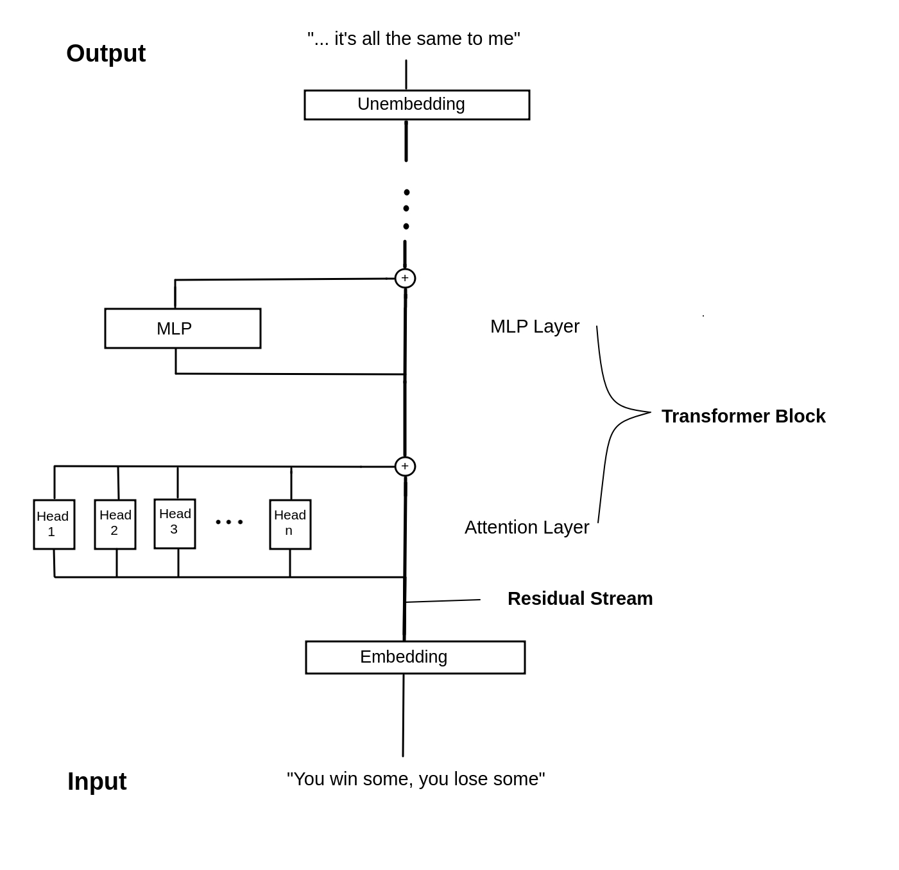

# miniGPT
MiniGPT - A small language model

This repository is an attempt on my part, to better understand transformer models, 
especially of the GPT flavour.
It is heavily inspired by (not to say stolen from) Neel Nandas' "Transformers from Scratch" tutorial, which can be found 
on his website https://www.neelnanda.io/.
A remake of this tutorial can be found here: https://arena-ch1-transformers.streamlit.app/[1.1]_Transformer_from_Scratch

I take no credit for the ideas presented here.

## Pre-requisites

To run the code in this repo, you will need a python3.9+ installation and the packages
from the requirements.txt

The easiest way to get started is to create a python virtualenv or a conda environment with python3.9
and then run

    pip install -r requirements.txt

## Transformer basics

The Transformer is a neural network architecture introduced by Vaswani et al. in the paper
"Attention is all you need" (https://arxiv.org/abs/1706.03762).
Since then, it became hugely popular and was used in many many many applications
for language modeling, most notably the GPT models. 
The GPT (Generative Pre-Trained) transformer model was introduced by OpenAI in 2018 (https://openai.com/research/language-unsupervised).
As of now (2023), ChatGPT, an application that uses a GPT-like model to generate language is so incredibly 
wide-known, even representatives of the austrian government have heard of it.
And representatives of the austrian government are not known to be particularly tech-savvy.

There are different transformer architectures out there, but I will focus on the GPT-style
transformer here.
On a very high level, the transformer architecture looks like this:

First, an embedding layer translates text input to floating-point numbers. These embeddings are 
the transformer-internal representation of the text. The output of the embedding layer is called residual
stream. It reaches from the input of the transformer all the way down to the output.
Each transformer layer gets its input from the residual stream and adds its output back to it.
It is the backbone of the transformer so to speak. 
After the embedding, the input is passed through a series of attention heads. Each head performs some
operation and then adds its output back to the residual stream.
The number of heads is a hyperparameter. The heads together constitute what is known as an Attention Layer.
After the attention layer, the residual stream passes through an MLP (multi-layer perceptron).
This is an ordinary densely connected neural network. The output of the MLP is again added to the 
residual stream.
These two layers, the Attention Layer, and the MLP Layer form a Transformer Block.
There may be many of these Transformer Blocks inside a specific model.
Finally, the residual stream passes through an Unembedding layer, where it is transformed back to text.

This is of course a very simplified representation. There are numerous details to consider, e.g. does
the transformer not operate on text directly, you usually want to add some normalization in between 
the layers, you need to specify several more hyperparameters like the size of the attention heads and
the MLP hidden dimension. Also, the transformer does not simply output text, but probabilities about
possible next tokens in a sequence.

The architecture is specified in gpt_mini/model.py You can go check out the details there.

## Training a Transformer

On a high-level, training a transformer seems simple.
You basically take some text (any text will do), pack it up into batches and feed it 
through the model. To understand what actually comes out of the transformer, we need to look again at the
transformer architecture, but now in a little more detail.

The model has an internal vocabulary. This is the list of words that the model knows of
and that it can work with. Not all entries in the vocabulary need to be real words, there can also
be parts of words or single letters. The vocabulary I use here is from Neels transformer lens 
repo. It has 50257 entries.

Each word that is fed to the transformer model, is converted into its corresponding index
from the vocabulary first, these indices are also called tokens. Note, that there is not necessarily a 1:1 conversion
between words and tokens. Some words may be split into two or more tokens.
These tokens are passed through the model and at the other end, we get a bunch of number, logits, as they
are called.
For each input token, we get 50257 logits, one for each entry in the vocabulary.
They are akin to a probability distribution over the whole vocabulary, and in fact, you 
can create a probability distribution out of them by applying a softmax function.

You can see this illustratted in the following image:

So, in words, a transformer "transforms" each input word (token, to be precise)
into a distribution over all words in the vocabulary.

The training process now looks like follows:

For each word in every sentence that we feed the model, it should correctly predict
the following word. So, for every word that we pass through the model, we take the logit
(which is a measure of probability) that corresponds to the following word and increase it.
The next time, this specific word will be passed through the model, the word that followed in
the training sentence, will get a higher probability.
So, we push the transformer to be a next-word predictor, for sentences that it
saw during training.

The training process is illustrated here:

Technically, this is done with Stochastic Gradient Descent, and it may take many thousands
of iterations over the training data, until the model can predict next words with
a high degree of certainty.

I used two datasets for training, the Pile-10k dataset from Neel (https://huggingface.co/datasets/NeelNanda/pile-10k/viewer/NeelNanda--pile-10k/train)
which includes the first 10k entries of the Pile (https://pile.eleuther.ai/) dataset and is a small but convenient
dataset for a quick training session.

The other one was the whole of the german Wikipedia (https://huggingface.co/datasets/wikipedia), which
is quite a lot bigger.

For the transformer architecture, I decided to go for 6 transformer layers (= 6 x Attention + MLP layer),
with 6 attention heads and a head dimension of 64, a model size (= size of the residual stream) of 256, a context length (= max. number of tokens that can fit
through the model at once) of 1024.
This is quite a small model. A very small model, actually. In fact, it has only around 34 million parameters (a parameter is 
a weight, a bias or any kind of floating point number that the model can adapt during training) whereas 
the smallest version of GPT2, gpt2-small, has around 163 million parameters.
I chose this model, because it was the largest that could fit into the memory of the one GPU I had 
at my disposal. For training larger models, you need to employ some fancier tricks e.g. data parallelism or using multiple GPUs,
than I did here.

## Generating language

Now for the fun part, using the transformer as a language model.
To actually generate text (e.g. as ChatGPT does), we can use the transformer in an autoregressive way.
What the hell is autoregressive? It basically means, that you will feed the output of the model back as an input in a loop, creating
new text each time.
Here is an image that illustrates this process.

