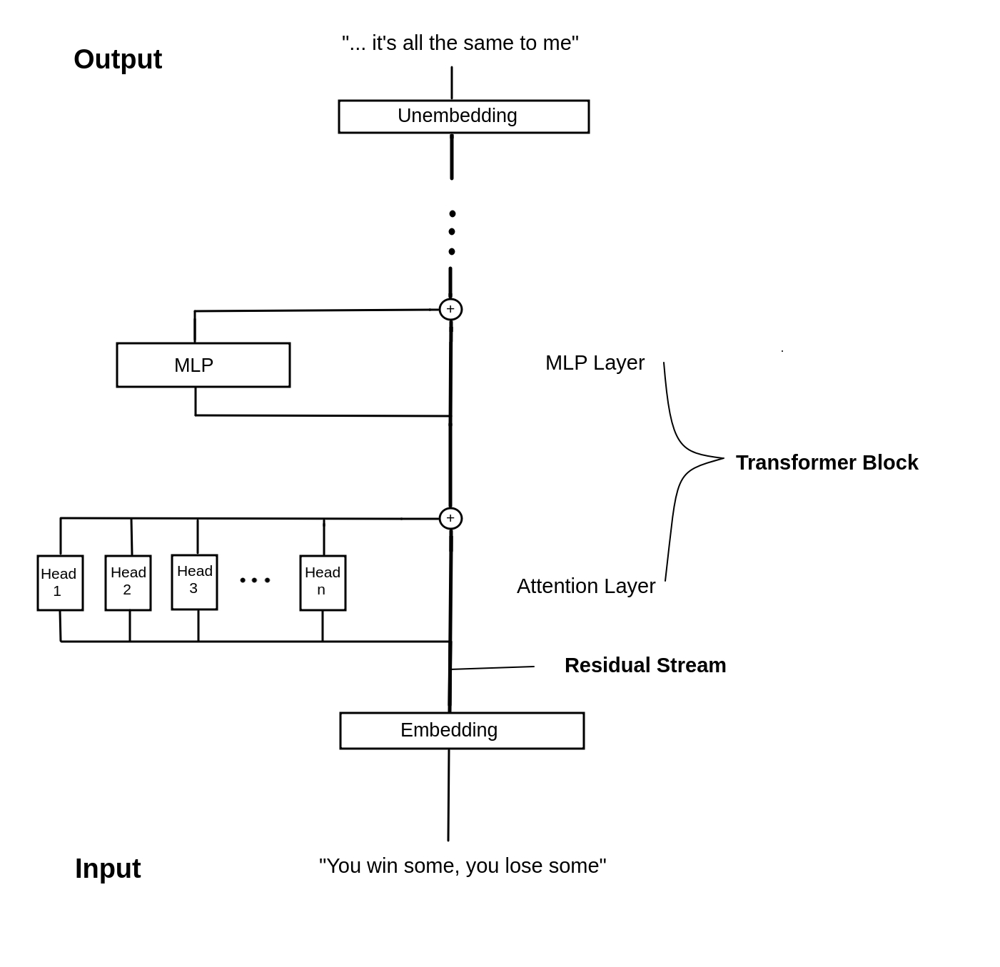
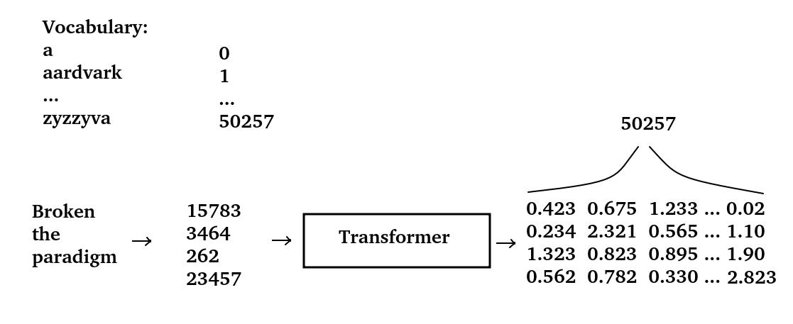
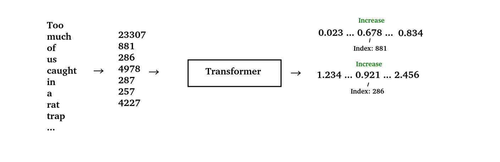
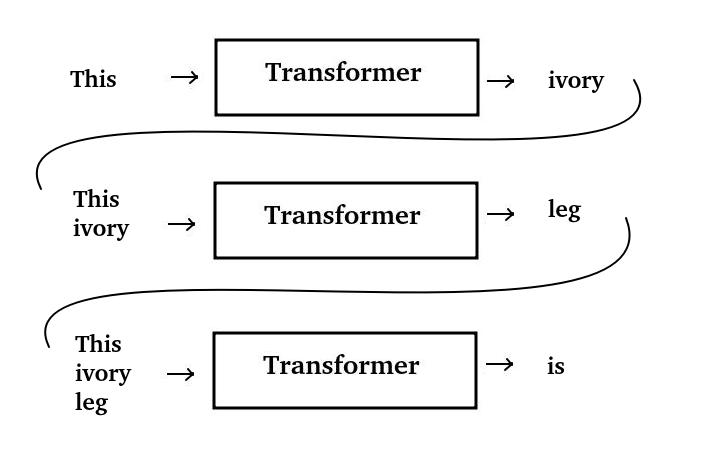
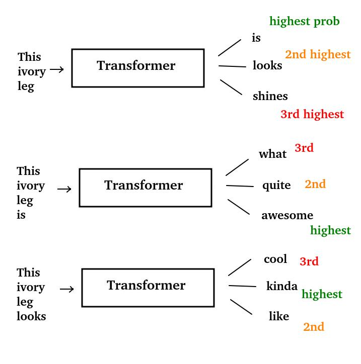

# miniGPT
MiniGPT - A small language model

This repository is an attempt on my part, to better understand transformer models, 
especially of the GPT flavour.
It is heavily inspired by Neel Nandas' "Transformers from Scratch" tutorial, which can be found 
on his website https://www.neelnanda.io/.
A remake of this tutorial can be found here: https://arena-ch1-transformers.streamlit.app/[1.1]_Transformer_from_Scratch
So, I would like to thank Neel and the ARENA people for creating these awesome resources and you should definitely check
them out.

## Pre-requisites

To run the code in this repo, you will need a python3.9+ installation and the packages
from the requirements.txt

The easiest way to get started is to create a python virtualenv or a conda environment with python3.9
and then run

    pip install -r requirements.txt

## Transformer basics

The Transformer is a neural network architecture introduced by Vaswani et al. in the paper
"Attention is all you need" (https://arxiv.org/abs/1706.03762).
Since then, it became hugely popular and was used in many many many applications
for language modeling, most notably the GPT models. 
The GPT (Generative Pre-Trained) transformer model was introduced by OpenAI in 2018 (https://openai.com/research/language-unsupervised).
As of now (2023), ChatGPT, an application that uses a GPT-like model to generate language is so incredibly 
wide-known, even representatives of the austrian government have heard of it.
And representatives of the austrian government are not known to be particularly tech-savvy.

There are different transformer architectures out there, but I will focus on the GPT-style
transformer here.
On a very high level, the transformer architecture looks like this:

First, an embedding layer translates text input to floating-point numbers. These embeddings are 
the transformer-internal representation of the text. The output of the embedding layer is called residual
stream. It reaches from the input of the transformer all the way down to the output.
Each transformer layer gets its input from the residual stream and adds its output back to it.
It is the backbone of the transformer so to speak. 
After the embedding, the input is passed through a series of attention heads. Each head performs some
operation and then adds its output back to the residual stream.
The number of heads is a hyperparameter. The heads together constitute what is known as an Attention Layer.
After the attention layer, the residual stream passes through an MLP (multi-layer perceptron).
This is an ordinary densely connected neural network. The output of the MLP is again added to the 
residual stream.
These two layers, the Attention Layer, and the MLP Layer form a Transformer Block.
There may be many of these Transformer Blocks inside a specific model.
Finally, the residual stream passes through an Unembedding layer, where it is transformed back to text.

This is of course a very simplified representation. There are numerous details to consider, e.g. does
the transformer not operate on text directly, you usually want to add some normalization in between 
the layers, you need to specify several more hyperparameters like the size of the attention heads and
the MLP hidden dimension. Also, the transformer does not simply output text, but probabilities about
possible next tokens in a sequence.

The architecture is specified in gpt_mini/model.py You can go check out the details there.

## Training a Transformer

On a high-level, training a transformer seems simple.
You basically take some text (any text will do), pack it up into batches and feed it 
through the model. To understand what actually comes out of the transformer, we need to look again at the
transformer architecture, but now in a little more detail.

The model has an internal vocabulary. This is the list of words that the model knows of
and that it can work with. Not all entries in the vocabulary need to be real words, there can also
be parts of words or single letters. The vocabulary I use here is from Neels transformer lens 
repo. It has 50257 entries.

Each word that is fed to the transformer model, is converted into its corresponding index
from the vocabulary first, these indices are also called tokens. Note, that there is not necessarily a 1:1 conversion
between words and tokens. Some words may be split into two or more tokens.
These tokens are passed through the model and at the other end, we get a bunch of number, logits, as they
are called.
For each input token, we get 50257 logits, one for each entry in the vocabulary.
They are akin to a probability distribution over the whole vocabulary, and in fact, you 
can create a probability distribution out of them by applying a softmax function.

You can see this illustratted in the following image:

So, in words, a transformer "transforms" each input word (token, to be precise)
into a distribution over all words in the vocabulary.

The training process now looks like follows:

For each word in every sentence that we feed the model, it should correctly predict
the following word. So, for every word that we pass through the model, we take the logit
(which is a measure of probability) that corresponds to the following word and increase it.
The next time, this specific word will be passed through the model, the word that followed in
the training sentence, will get a higher probability.
So, we push the transformer to be a next-word predictor, for sentences that it
saw during training.

The training process is illustrated here:

Technically, this is done with Stochastic Gradient Descent, and it may take many thousands
of iterations over the training data, until the model can predict next words with
a high degree of certainty.

I used two datasets for training, the Pile-10k dataset from Neel (https://huggingface.co/datasets/NeelNanda/pile-10k/viewer/NeelNanda--pile-10k/train)
which includes the first 10k entries of the Pile (https://pile.eleuther.ai/) dataset and is a small but convenient
dataset for a quick training session.

The other one was the whole of the german Wikipedia (https://huggingface.co/datasets/wikipedia), which
is quite a lot bigger.

For the transformer architecture, I decided to go for 6 transformer layers (= 6 x Attention + MLP layer),
with 6 attention heads and a head dimension of 64, a model size (= size of the residual stream) of 256, a context length (= max. number of tokens that can fit
through the model at once) of 1024.
This is quite a small model. A very small model, actually. In fact, it has only around 34 million parameters (a parameter is 
a weight, a bias or any kind of floating point number that the model can adapt during training) whereas 
the smallest version of GPT2, gpt2-small, has around 163 million parameters.
I chose this model, because it was the largest that could fit into the memory of the one GPU I had 
at my disposal. For training larger models, you need to employ some fancier tricks e.g. data parallelism or using multiple GPUs,
than I did here.

## Generating language

Now for the fun part, using the transformer as a language model.
To actually generate text (e.g. as ChatGPT does), we can use the transformer in an autoregressive way.
What the hell is autoregressive? It basically means, that you will feed the output of the model back as an input in a loop, creating
new text each time.
Here is an image that illustrates this process.

At each step of the process, you feed text through the transformer, sample a word from the output, append
it to your text and feed back into the transformer.
In this way, you create language, one word at a time.
Sounds easy, right? But before we can actually do this ourselves, we need to talk about
one more thing. The way we sample from the transformer outputs.
As you already know, the transformer outputs a number (a logit) for each word in the vocabulary.
Since this logit is a measure of the probability of the respective word occurring, we can just take
the largest logit, fetch the corresponding word from the vocabulary and use it as the next word in the
text. This actually works and is rather easy to implement, but does not usually produce the most
interesting texts. But we can also do something more sophisticated.
Using only the word with the highest probability (logit) at each stage is kind of a narrow-sighted approach.
This method really only looks one word ahead. But language, as you know, is far more complex than that.
Words from the beginning of a sentence can be referenced by words from the end of a sentence, e.g. as in: 

"The sausage, albeit looking kind of weird, tasted good."

Beam-search, another sampling method, is designed to capture the natural flow of language more closely.
Here, we don't just look at the highest probability word at each step, but the highest probability of a longer sequence of word.

At each step, we don't just look at the highest probability word, but the n (say, 3) words
with the highest probability. We append each of them to the input and store them as 
separate alternatives (beams). Then we create another set of n output words for each of the beams we just stored.
In this way, we generate a number of beams. The highest probability beam is then just the beam
which has the highest sum of probabilities for each word.

Beam search tends to work much better, generating much more natural texts than the "highest-probability only" approach (also called greedy-sampling).
However, it is also much more resource-intensive, since you have to store each chain of possible words (beam) until
you decide which one is the one to go.

There are more sampling methods than these two (e.g. sampling with temperature), but they are of no concern here.
Alright, then let's actually generate text, shall we?

To generate text yourself, you will need a set of weights of a trained transformer model.
If you don't want to actually run the training step, I provided you with the weights of a fully
trained gpt2-small model, which you can use for playing around.

You can run

    python3 gpt_mini/generate.py --weights <path_to_weights_file> \
        --sampling-method <beam or greedy> \
        --prompt "Your text here"

When you want to use the gpt2-small weights, run instead of --weights with --use-gpt2

## TEST

Now for the fun part, actually generating language with a language model!
I won't do any systematic tests here, just play around with some prompts and see what I can get out.

Okay, let's start with an easy one. Say, I always dreamt of going to Italy, but something unexpected
always prevented me from doing so. Models, what do you have to say 'bout that?

    Whenever I want to go to Italy, ...

| **Model/Train set** | **Sampling method** | **Text**                                                                                                                                                                                   |
|---------------------|---------------------|--------------------------------------------------------------------------------------------------------------------------------------------------------------------------------------------|
| miniGPT / Pile10k   | Greedy              | Whenever I want to go to Italy, I would be a Christy, but I would be a visiting the Mormons would be the Mormons would be the Mormons, and I would like to the publisher.                  |
| miniGPT / Pile10k   | Beam                | Whenever I want to go to Italy, but I would I was going on the next year.I would be sure that if I did this would you could I do you would it was the first, I could you had the only woul |
| gpt2-small          | Greedy              | Whenever I want to go to Italy, I have to go to Italy. I have to go to Italy. I have to go to Italy. I have to go to Italy. I have to go to Italy. I have to go to                         |
| gpt2-small          | Beam                | Whenever I want to go to Italy, I don't know if I'll be able to do it," he said.                                                                                                           |

Okay, so far so good, the answers range from absolute gibberish to something resembling a sentence.
Maybe they need some more material to work with. Let's be more specific:

    In recent years, it was not possible to get an affordable housing credit without ... 

| **Model/Train set** | **Sampling method** | **Text**                                                                                                                                                                                                                     |
|---------------------|---------------------|------------------------------------------------------------------------------------------------------------------------------------------------------------------------------------------------------------------------------|
| miniGPT / Pile10k   | Greedy              | In recent years, it was not possible to get an affordable housing credit without the development of the development of the development of the development of the development of the development                              |
| miniGPT / Pile10k   | Beam                | In recent years, it was not possible to get an affordable housing credit without paying dividends. “It’s not a lot of money,” he said. “I am going to be paying for money. I am very good,                                   |
| gpt2-small          | Greedy              | In recent years, it was not possible to get an affordable housing credit without a mortgage. "We're seeing a lot of people who are struggling to find a place to live," said Mr. Kowalski. "We're seeing a lot of people who |
| gpt2-small          | Beam                | In recent years, it was not possible to get an affordable housing credit without having to buy a home in the city.                                                                                                           |

Also, quite okay. It is no surprise that gpt2-small produces much more meaningful sentences than my own model.
But with beam search, even my miniGPT can come up with sentences that are at least sentences.
With greedy sampling however, my model is prone to repeat itself, whereas gpt2-small handles greedy sampling quite well.

Okay, but maybe finance is not their expertise. How about movies?

    In my opinion, the best movie starring Tom Cruise is ...

| **Model/Train set** | **Sampling method** | **Text**                                                                                                                                                                                                                                            |
|---------------------|---------------------|-----------------------------------------------------------------------------------------------------------------------------------------------------------------------------------------------------------------------------------------------------|
| miniGPT / Pile10k   | Greedy              | In my opinion, the best movie starring Tom Cruise is the character of the young Shakespeare, the young Shakespeare, the Virgin, the Virgin, the Bruce, the Bruce, the Bruce, the two of the Yorkshire, the Yorkshire, the Yorkshire, the Yorkshire  |
| miniGPT / Pile10k   | Beam                | In my opinion, the best movie starring Tom Cruise is one of the actors. White House (  GOOGLE MAP ) ; www.org.uk; adult/child £5.50/free;  h10am-5                                                                                                  |
| gpt2-small          | Greedy              | In my opinion, the best movie starring Tom Cruise is the one that has the most impact on the world. It's a movie that has a lot of potential. It's a movie that has a lot of potential. It's a movie that has a                                     |
| gpt2-small          | Beam                | In my opinion, the best movie starring Tom Cruise is The Dark Knight Rises. It's a great movie, but it's not a good movie.                                                                                                                          |

This is pretty terrible. At least we could get a movie title with gpt2-small and beam search.

Okay, one more. How about geopolitics?

    The collapse of the Soviet Union was the ...

| **Model/Train set** | **Sampling method** | **Text**                                                                                                                                                                                                 |
|---------------------|---------------------|----------------------------------------------------------------------------------------------------------------------------------------------------------------------------------------------------------|
| miniGPT / Pile10k   | Greedy              | The collapse of the Soviet Union was the baptism of the unit of the unit of the unit of the unit ...                                                                                                     |
| miniGPT / Pile10k   | Beam                | The collapse of the Soviet Union was the corporation. “It is a Communist Party,” he said, “I don’t know that there are a lot of people who are in the United States.                                     |
| gpt2-small          | Greedy              | The collapse of the Soviet Union was the result of a series of events that were not only the result of the collapse of the Soviet Union, but also the result of the collapse of the Soviet Union itself. |
| gpt2-small          | Beam                | The collapse of the Soviet Union was the most important event in the history of human history. It was also the beginning of a new era of                                                                 |

Enough.

### Honorable mentions

Perhaps you are wondering what happened to the model trained on the german wikipedia. Well, I thought
this would produce some really cool outputs, because it was trained on a much larger dataset than the pile.
However, this was not the case.
Rather, it always produces outputs like:

    In der Wüste Gobi gibt es ...
    In der Wüste Gobi gibt es beweiseen d. d“ eine einem eines einer durchs

or

    Der afrikanische Strauß ist eine Vogelart ...
    Der Afrikanische Strauß (Struthio camelus) ist eine Vogelart’amu.) (i) us (engl.aurei.i

So, that did not really work out.

## Wrap-up

To be honest, the results are a little disappointing. I should have braced myself against too high expectations,
but there is always the hope that "maybe if I do ..."
Well, maybe if I do a little more training ...
Anyway, getting good results was never the goal in the first place. Creating a language model
from scratch was an incredibly insightful (and also often very frustrating) experience and I learned a ton while doing
it. I think, even with a little disappointment in the end, this project was absolutely worth the time I spent in it.
So, I guess there is nothing left to say?

Model,

    What is left?

    Model: There are a lot of things that can be done to improve the quality of life for people ...

Well, let's not go there now ...

